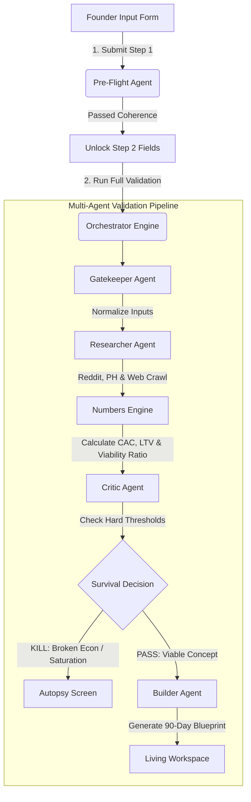

# DueDiligence.AI

An automated, adversarial multi-agent system that stress-tests software startup ideas before a single line of code is written. It prevents developers and founders from building products that have broken unit economics or are entering oversaturated markets.

---

## 🚀 System Architecture Overview

DueDiligence.AI orchestrates a pipeline of specialized AI agents to rigorously evaluate startup ideas. It combines web-scraping intelligence, sentiment analysis, and deterministic financial modeling with strict validator filters to produce an absolute **GO / NO-GO** decision.



---

## 🛠️ Key Architectural Components

### 1. Two-Step Pre-Flight Validation
* **Step 1 Coherence Check**: The frontend verifies minimum length constraints (80+ characters) and sends the thesis to a lightweight `pre_flight_agent` using Gemini 2.5 Flash to ensure it describes a concrete software idea rather than generic queries.
* **Step 2 Parameter Intake**: Upon passing, the UI reveals quantitative inputs including Runway, Target Geography, Customer Persona, Marketing Budget, and traction indicators (Waitlist size or MRR).

### 2. Multi-Agent Pipeline
* **Gatekeeper Agent**: Sanitizes and normalizes the pricing inputs (e.g. translating multi-select monetization schemes into normalized categories) to ensure compatibility.
* **Researcher Agent**: Runs concurrent web scrapes across GitHub, Product Hunt, and Google via custom MCP tools. It computes a **Market Saturation Score (0.0 to 10.0)** and a **Reddit Sentiment Delta** indicating user frustration (opportunity) vs user satisfaction (market barrier).
* **Numbers Engine**: A mathematical agent applying industry benchmarks to estimate **Customer Acquisition Cost (CAC)**, **Lifetime Value (LTV)**, and the critical **Viability Ratio ($LTV/CAC$)**.
* **Critic Agent**: Acts as the ultimate validator. If the viability ratio is below $3.0\times$ or if saturation is high without a clear unique differentiator, the Critic triggers a hard `KILL` filter (e.g. `KILL: UNIT_ECON_BROKEN` or `KILL: SATURATION_NO_DIFFERENTIATOR`).
* **Builder Agent**: Triggered only upon survival. This agent compiles the final product roadmap, risk mitigation matrix, and daily task list divided into a 90-day timeline.

---

## 📈 Autopsy Screen (Kill Screen v1.1) Specifications

When the system triggers a `KILL` decision, the user is redirected to the **Autopsy Dashboard** featuring:
* **Viability Ratio Card**: Displays the computed $LTV / CAC$ ratio colored dynamically based on survival risk (Red `< 3.0`, Amber `3.0–5.0`, Green `> 5.0`).
* **Plain-English Explanations**: Synthesizes the core reason for failure to close comprehension gaps (e.g., explaining why acquiring free users on a $310 CAC destroys a 3-month runway).
* **Reddit Sentiment Delta Interpretation**: Displays an LLM-generated translation explaining if the online sentiment implies an active market opportunity or a high entry barrier.
* **Alternative Scenario Pivot Projections**: Calculates projected viability ratios dynamically for critical pivots:
  * *Switch Monetization Model*: Simulates shifting from freemium to flat-rate subscription models (lowering monthly churn to 4%).
  * *Target Enterprise Tier*: Simulates raising MRR benchmarks to a premium $150+ tier.
* **Stress-Test Pivot Flow**: Replaces standard resets with a custom CTA that keeps all form fields pre-populated and highlights the exact variable that killed the thesis with a yellow border and tooltip.

---

## 🔄 The Living Execution Workspace (Phase 2 Additions)

For startup ideas that clear the Critic's gates, the static 90-day roadmap is transformed into an interactive progress-tracking workspace:

### 1. Persistence Layer (`diligence.db` SQLite)
* **Ingestion Function**: Immediately upon the Builder agent completing execution, the 90 tasks are parsed and bulk-inserted into `roadmap_tasks`, and the parent metadata (percentage, current day, status) is stored in `roadmap_sessions`.
* **Failsafe caching**: The Redis cache layer remains fully functional as a fallback during database commits.

### 2. Task State API & Progress Calculator
* `GET /workspace/{roadmap_session_id}`: Retrieves the session's overall progress alongside all 90 daily tasks grouped cleanly by week (Weeks 1 to 13).
* `PATCH /workspace/tasks/{task_id}`: Updates a task status to `'complete'` or `'skipped'`. This triggers an automatic recalculation of overall completion percentage and the **Slippage Score**.
* **Slippage calculation**: Compares calendar days elapsed (`current_day`) against the highest `day_number` of tasks marked `'complete'`. Returns a dynamic metric indicating if the project is `on_track` (slippage <= 2 days).

### 3. Automated Retention Loops
* **Daily Cron Job**: Increments the `current_day` counter daily at midnight for all active sessions using `APScheduler`.
* **Weekly Check-in Scheduler**: Evaluates active sessions at Day 7, Day 14, etc. If the founder is on schedule, they receive an encouraging email via SendGrid. If they fall behind (`slippage_days > 2`), they receive a warning detailing exactly how many days they are behind and how many tasks are open.
* **Safety Gate**: Ensures no duplicate check-ins are sent within 5 days.
* **Pause Endpoint (`PATCH /workspace/{id}/pause`)**: Freezes the workspace counter and prevents daily increments or weekly notifications during team pivots.

### 4. Interactive Workspace UI
* **Horizontal Kanban Board**: Displays 13 columns representing Weeks 1–13. Includes current week highlights.
* **Optimistic Updates**: Task checking transitions instantly in the browser before the database sync is confirmed, reversing gracefully on API network failures.
* **Breathing Hexagon Progress Indicator**: A sharp, mechanical SVG progress hexagon that fills up proportionally and breathes dynamically.
* **Slippage Banner**: Displays warning copy: `"You're {slippage_days} days behind schedule. {N} tasks from earlier weeks are still open."`
* **Viewport Scrolling**: The `"Jump to oldest open task"` button instantly scrolls the Kanban board to center the oldest week containing incomplete items.
* **Milestone Markers**: Injects visual checkpoints at the bottom of the Week 4, Week 8, and Week 12 columns to highlight broader targets.

---

## 💻 Tech Stack

* **Backend**: FastAPI (Python 3.11+), Pydantic v2 (Strict schema validation), Uvicorn.
* **Agent Brain**: Gemini 2.5 Flash (via Google GenAI ADK).
* **Database**: SQLite (Telemetry logging, persistence) & Redis (In-memory fallback caching).
* **Scheduling**: APScheduler (Background task synchronization).
* **Communications**: SendGrid API.
* **Frontend**: HTML5, Vanilla CSS3, & Modern Javascript (Zero frameworks, optimistic UI rendering, responsive grid layouts).

---

## ⚙️ Quick Start Installation

### Prerequisites
* Python 3.10+
* Git
* Gemini API Key (stored in your environment variables as `GEMINI_API_KEY`)
* SendGrid API Key (optional, stored as `SENDGRID_API_KEY`)

### Setup Commands
1. **Clone the Repository**:
   ```bash
   git clone https://github.com/yuvraj-aura/DueDiligence.AI.git
   cd DueDiligence.AI
   ```

2. **Set up Virtual Environment**:
   ```bash
   python -m venv .venv
   # On Windows:
   .venv\Scripts\activate
   # On macOS/Linux:
   source .venv/bin/activate
   ```

3. **Install Dependencies**:
   ```bash
   uv pip install -r requirements.txt
   ```

4. **Configure Environment Variables**:
   Create a `.env` file in the root directory:
   ```env
   GEMINI_API_KEY=your_gemini_api_key_here
   SENDGRID_API_KEY=your_sendgrid_api_key_here
   ```

5. **Start the API Server**:
   ```bash
   python -m uvicorn api.main:app --reload
   ```

6. **Access the Frontend**:
   Open your browser and navigate to `http://localhost:8000/ui/index.html`.
